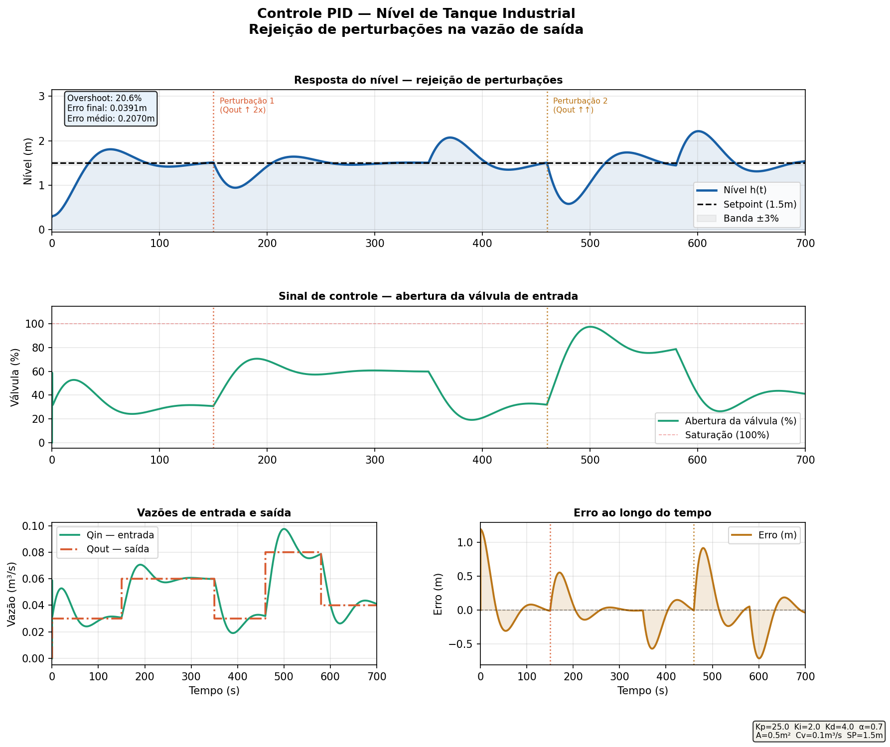

# Controle PID — Nível de Tanque Industrial

Simulação de controlador PID aplicado ao controle de nível de um tanque industrial com perturbações variáveis na vazão de saída.

## Resultado



## Descrição

O sistema simula um tanque industrial com válvula de entrada controlada pelo PID e válvula de saída que varia ao longo do tempo (perturbação).

**Modelo da planta:**
```
dh/dt = (Qin - Qout) / A
Qin   = Cv * (u / 100)     ← controlada pelo PID
Qout  = perturbação variável
```

## Perturbações simuladas

| Intervalo | Qout (m³/s) | Evento |
|-----------|-------------|--------|
| 0 – 150s | 0.03 | Operação normal |
| 150 – 350s | 0.06 | **Perturbação 1** — saída dobra |
| 350 – 460s | 0.03 | Retorno ao normal |
| 460 – 580s | 0.08 | **Perturbação 2** — saída forte |
| 580s+ | 0.04 | Novo ponto de operação |

## Métricas de desempenho

| Métrica | Valor |
|---------|-------|
| Overshoot inicial | ~20.6% |
| Erro final | ~0.039m |
| Erro médio em regime | ~0.207m |

## Parâmetros do controlador

| Parâmetro | Valor | Função |
|-----------|-------|--------|
| Kp | 25.0 | Resposta proporcional ao erro de nível |
| Ki | 2.0 | Elimina erro em regime permanente |
| Kd | 4.0 | Amorte oscilações nas perturbações |
| α (filtro D) | 0.7 | Suaviza o derivativo — reduz efeito de ruído |

## Conceitos implementados

- Modelo físico de tanque com balanço de massa (dh/dt = (Qin - Qout) / A)
- **Filtro passa-baixa no derivativo** — técnica industrial para reduzir sensibilidade a ruído
- **Anti-windup** no integrador — evita acúmulo durante saturação da válvula
- Saturação do atuador (válvula 0–100%)
- Dois perfis de perturbação com intensidades diferentes
- Cálculo de overshoot, erro final e erro médio em regime

## Aplicações industriais

Controle de nível é fundamental em refinarias de petróleo, estações de tratamento de água, indústria alimentícia, farmacêutica e química — qualquer processo que envolva reservatórios e tanques de processo.

## Como executar

```bash
pip install numpy matplotlib
py pid_tanque.py
```

Gera `resultado_pid_tanque.png` com 4 painéis:
1. Nível do tanque ao longo do tempo com perturbações marcadas
2. Abertura da válvula de entrada (sinal de controle)
3. Vazões de entrada e saída
4. Erro ao longo do tempo

---

*Projeto desenvolvido como parte do portfólio de Engenharia de Controle e Automação — UPE*
