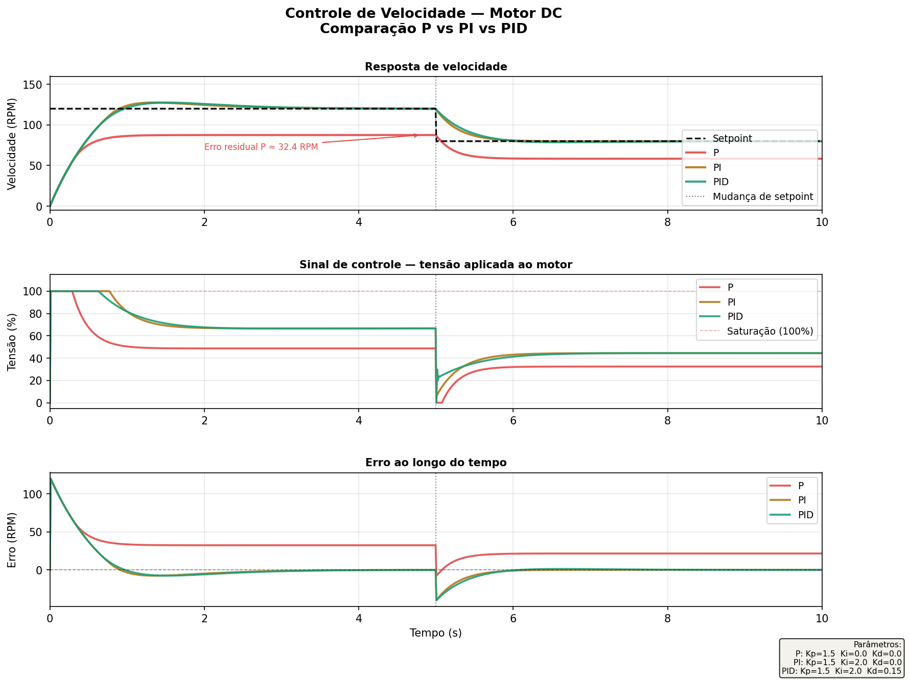

# Controle PID — Velocidade de Motor DC

Simulação de controlador PID aplicado ao controle de velocidade de um motor DC, com comparação direta entre controladores P, PI e PID no mesmo gráfico.

## Resultado



## Descrição

O sistema simula um motor DC com inércia e atrito, controlando a velocidade em RPM via variação da tensão aplicada (0–100%).

**Perfil de setpoint:**
- t=0s até t=5s → referência de **120 RPM**
- t=5s até t=10s → referência de **80 RPM** (mudança de velocidade)

## Por que comparar P, PI e PID?

| Controlador | Comportamento | Limitação |
|-------------|---------------|-----------|
| **P** | Responde rápido ao erro | Deixa erro residual permanente |
| **PI** | Elimina erro residual | Pode oscilar mais |
| **PID** | Resposta rápida + sem erro + amortecido | Mais complexo de sintonizar |

O gráfico mostra claramente que o controlador **P sozinho não consegue atingir o setpoint** — fica com ~32 RPM de erro residual. O **PI e o PID eliminam esse erro**, e o **PID** ainda amorece melhor as oscilações na mudança de setpoint.

## Métricas de desempenho (fase 1: 0 → 120 RPM)

| Controlador | Overshoot | Erro final | Tempo de subida |
|-------------|-----------|------------|-----------------|
| P | 0% | ~32 RPM | — |
| PI | ~6.4% | ~0.09 RPM | ~0.67s |
| PID | ~6.3% | ~0.04 RPM | ~0.68s |

## Parâmetros

**Planta (motor DC):**
- Ganho K = 1.8 RPM/%
- Constante de tempo τ = 0.8s

**Controladores:**
| Parâmetro | P | PI | PID |
|-----------|---|----|-----|
| Kp | 1.5 | 1.5 | 1.5 |
| Ki | 0.0 | 2.0 | 2.0 |
| Kd | 0.0 | 0.0 | 0.15 |

## Conceitos implementados

- Controlador PID discreto (método de Euler)
- Anti-windup no integrador
- Saturação do atuador (0–100%)
- Perfil de setpoint variável (degrau duplo)
- Cálculo de métricas: overshoot, erro em regime permanente, tempo de subida

## Como executar

```bash
pip install numpy matplotlib
py pid_motor.py
```

Gera o arquivo `resultado_pid_motor.png` com três painéis:
1. Velocidade em RPM — comparação P vs PI vs PID
2. Sinal de controle (tensão aplicada)
3. Erro ao longo do tempo

---

*Projeto desenvolvido como parte do portfólio de Engenharia de Controle e Automação — UPE*
