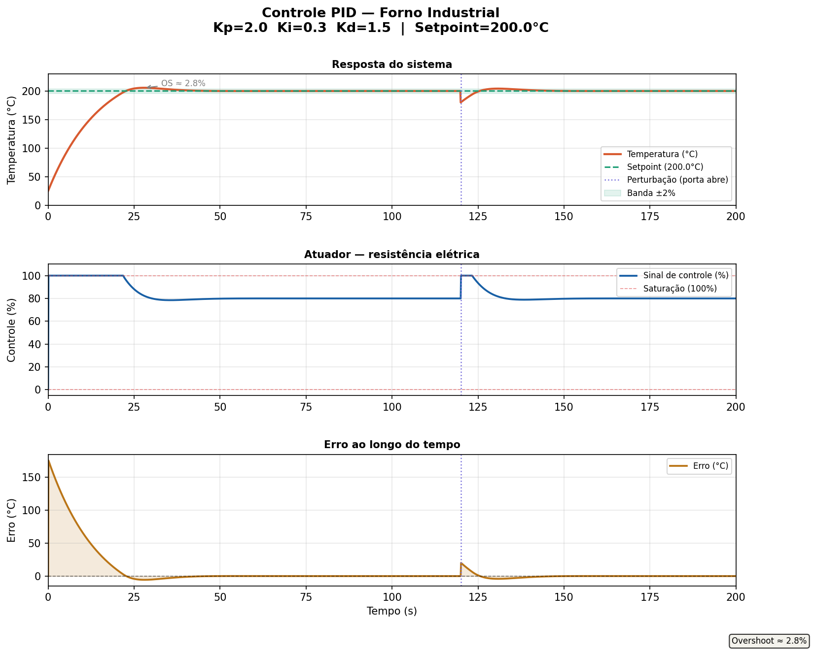

# Controle PID — Temperatura de Forno Industrial

Simulação de controlador PID aplicado ao controle de temperatura de um forno industrial, implementado em Python com modelo de planta de primeira ordem (FOPDT).

## Resultado



## Descrição

O sistema simula um forno industrial com as seguintes características:

- **Planta:** modelo FOPDT (First Order Plus Dead Time) — G(s) = K / (τs + 1)
- **Setpoint:** 200°C
- **Temperatura inicial:** 25°C (ambiente)
- **Perturbação:** queda de 20°C em t=120s (simulando abertura da porta do forno)
- **Atuador:** resistência elétrica com saturação de 0% a 100%

## Métricas de desempenho

| Métrica | Valor |
|---------|-------|
| Overshoot | ~2.8% |
| Erro em regime permanente | < 0.001°C |
| Resposta à perturbação | recuperação completa |

## Parâmetros do controlador

| Parâmetro | Valor | Função |
|-----------|-------|--------|
| Kp | 2.0 | Resposta proporcional ao erro |
| Ki | 0.3 | Elimina erro em regime permanente |
| Kd | 1.5 | Amorte oscilações e melhora estabilidade |

## Conceitos implementados

- Controlador PID discreto com integração por método de Euler
- **Anti-windup** no integrador — evita acúmulo de integral durante saturação do atuador
- **Saturação do atuador** — limita sinal de controle entre 0% e 100%
- Simulação de perturbação externa em regime permanente
- Cálculo automático de métricas: overshoot, tempo de subida e tempo de acomodação

## Como executar

```bash
# Instalar dependências
pip install numpy matplotlib

# Executar simulação
python pid_temperatura.py
```

O script gera o gráfico `resultado_pid_temperatura.png` com três painéis:
1. Resposta da temperatura ao longo do tempo
2. Sinal de controle do atuador (%)
3. Erro instantâneo

## Estrutura do código

```
pid_temperatura.py
├── Parâmetros da planta (K, tau, dt)
├── Parâmetros do PID (Kp, Ki, Kd)
├── Loop de simulação
│   ├── Cálculo do erro
│   ├── Integral com anti-windup
│   ├── Derivativo
│   ├── Saturação do atuador
│   └── Modelo da planta (Euler)
├── Cálculo de métricas
└── Geração dos gráficos
```

## Dependências

- Python 3.8+
- NumPy
- Matplotlib

## Aplicações industriais

Controle de temperatura por PID é utilizado em fornos industriais, pasteurizadores, autoclaves, reatores químicos e sistemas de climatização industrial (HVAC).

---

*Projeto desenvolvido como parte do portfólio de Engenharia de Controle e Automação — UPE*
